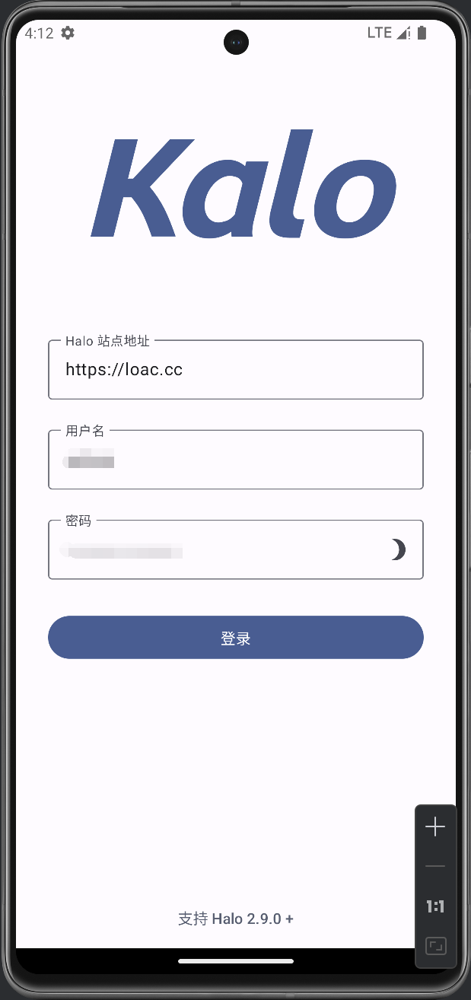
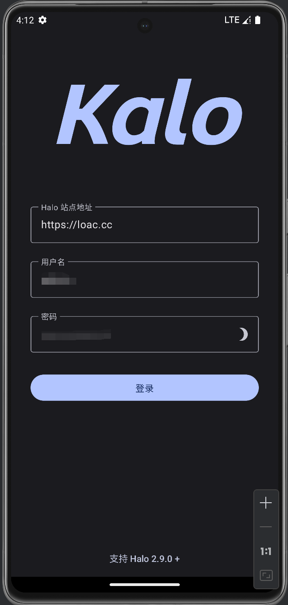
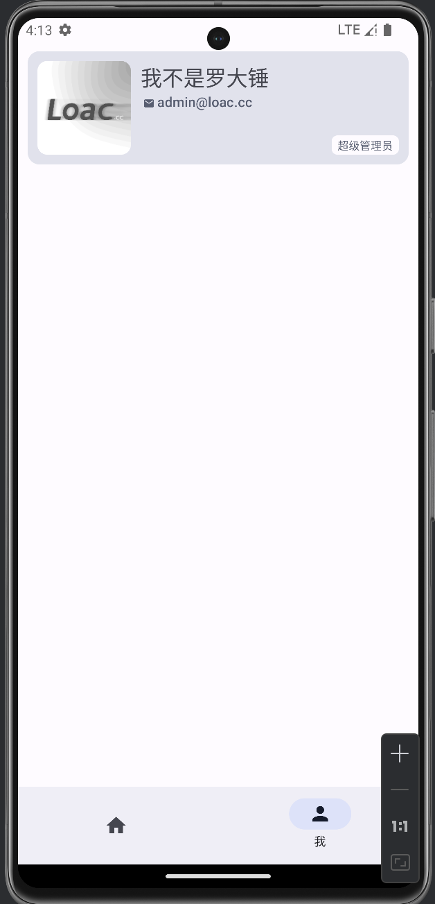
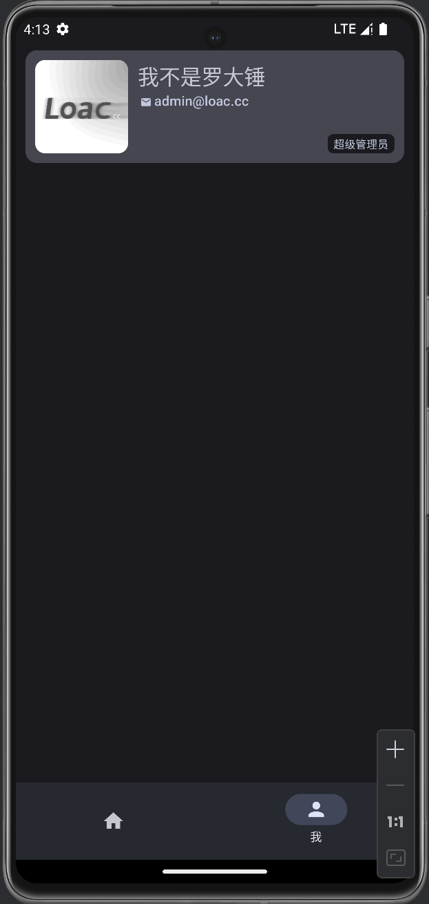

发行版只支持到 Halo 1.6.0，用 Jetpack Compose 重写的支持 Halo 2.9.0 的版本**正在开发中**，Halo 1.6.0 （Uni-app）旧分支请查看以下链接：

- Gitee：[release-0.0.5-Halo1.6.0](https://gitee.com/luodachui/halo-mobile-app/tree/release-0.0.5-Halo1.6.0/)
- GitHub：[release-0.0.5-Halo1.6.0](https://github.com/LuodachuiXG/halo-mobile-app/tree/release-0.0.5-Halo1.6.0)

### 🎈未来开发计划

2023 年 10 月 13 号

目前偶尔抽空更新一下，24  年 1 月后会有更多时间开发...

# 🍻Kalo

📱[Halo](https://halo.run/) Admin app
📱[Halo ](https://halo.run/) 博客管理程序移动端

Github：[📱Halo 博客管理程序移动端](https://github.com/LuodachuiXG/halo-mobile-app)

Gitee：[📱Halo 博客管理程序移动端](https://gitee.com/luodachui/halo-mobile-app)

### 📣截图

> 新版的部分截图，仍在开发中，仅供参考...

### ❤️感谢

感谢你们的支持！

|               捐赠者               |
| :--------------------------------: |
| [ipride](https://gitee.com/ipride) |
